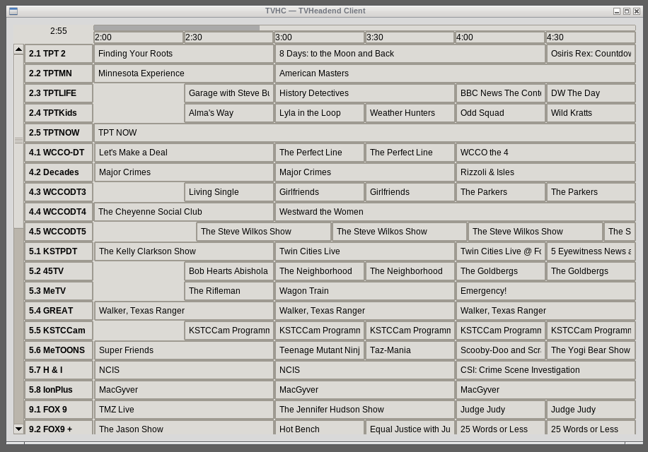
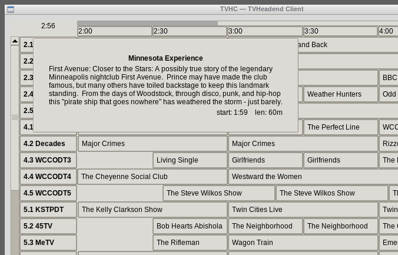
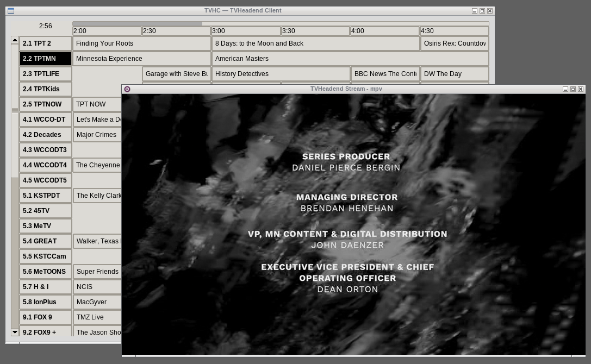

# tvhc — a TVHeadend Client

`tvhc.py` is a TVHeadend client application for watching live TV.

It's a simple tkInter application that uses `mpv` to play live TV 
streams from a TVHeadend server.

## Background

Background: I tried and failed to get tvhplayer working. It seemed to be
incompatible with the version of the VLC library on my system, so it
couldn't play live streams. The recording functions also failed to
work for reasons I couldn't figure out. I started trying to do some
troubleshooting, but tvhplayer totaled about 3000 lines of code, which
is way large and more complicated than would be required for the
simple functionality I wanted.  So I wrote tvhc.

I ended up with a single-file tkInter application totaling around 250
lines of code.

## Building tvhc

There is no building. It's a single Python file `tvhc.py`.

## Installing

Either put `tvhc.py` it somewhere in your path or invoke it with an
explicit path.

## Dependencies

I think the only dependency other than tkInter and the Python standard
library is the [requests
library](https://github.com/psf/requests). Consult your system
documentation on how to install that.

## Configuration

Configuration values are read from the file `~/.tvhc.ini`:
~~~
  Server = 192.168.1.45:9982
  Username = username
  Password = password
  UseTLS = no
  Auth = Digest
~~~

All fields except Server are optional.

Auth may be one of None, Plain, Basic, or Digest. Plain and Basic are
the same thing. If neither Username nor Password are present, then
Auth defaults to None, otherwise it defaults to Digest.

## Usage

When started, the tvhc application will display a program grid showing
the next few hours of live TV available from the TVHeadend
client. Clicking on any of the rows in the program grid will start an
instance of the `mpv` player with the stream from that TV channel.

Clicking on that row again will stop `mpv`.

Clicking on another row while `mpv` is playing will stop the running 
`mpv` and start a new instance of `mpv` for the new row's channel.

Right-clicking on a program will show a pop-up window with the program
details.  Clicking anywhere will dismiss the program details pop-up.

## Screenshots

Here are a few screenshots showing what it looks like:

### Program Grid

### Program Details

### Program Playing

